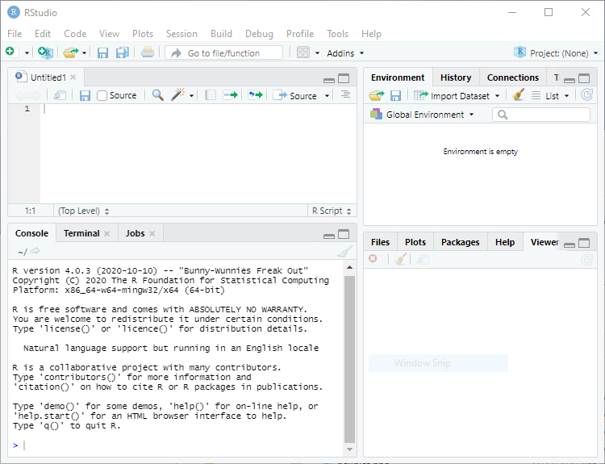

# 2 Getting Started

Obviously the first thing you need to do is download a copy of R. This tutorial
was last revised using version 4.2.1, released in June 2022. New releases occur every 
six months or so. You will find the latest version and binaries for Windows, Mac OS X, 
and Linux in the [Comprehensive R Archive Network](https://cran.r-project.org/). 
Find the  mirror nearest you and follow the links. The Windows installer is fairly 
easy to use and, after agreeing to the license terms, lets you choose which 
components you want to install. Additional packages can always be installed 
directly from R at a later time. 

The next thing you should do is install R Studio, a nice Integrated Development 
Environment (IDE) for R, that is available for Windows, Mac OS X, and Linux. 
You can download the free open source edition of R Studio Desktop from 
<https://rstudio.com/products/rstudio/>. Once the software is installed, it 
will find and  integrate your R installation. 


\includegraphics[width=\textwidth]{RStudioIDE.png}

The panel on the lower-left corner of the IDE shows the console, which is
described below.  Graphs and help will appear on the bottom right panel. 
The panel on the top left can be used to type an R script to be run later. 

If you do not install R Studio, you can still run the R graphical user 
interface (GUI). I recommend that you create a shorcut on the  desktop.
When R starts you see a console. Graphs appear on a separate window.

## 2.1 The Console

The console in R Studio (or R) is where you  type R expressions and see text 
results.  You are prompted to type some input with the greater than symbol. 
To quit R Studio (and R) type

```{.r}
> q()
```

Note the parentheses after the `q`. This is because in R you do not type 
commands, but rather call *functions* to achieve results, even quit! To call a 
function you type the name followed by the arguments in parentheses. If the 
function takes no arguments, you just type the name followed by left and right 
parenthesis. (If you forget the parentheses and type just the name of the 
function, R will list the source code.)  After typing `q()` you are asked 
whether you want to save the current work environment. You can skip this prompt 
by typing `q("no")`.

You should also know about the `help()` function, which uses the window on the 
bottom right (opens a separate help window in R). The function can be called 
with arguments to obtain help about specific features of R, for example 
`help(plot)`.  A shortcut for help on a topic is a question mark followed by 
the topic, as in `?plot`.  

The console allows input editing.  You will find that the left and right arrow 
keys, home, end, backspace, insert, and delete work exactly as you would 
expect. You also get an input history: the up and down arrow keys can be used 
to scroll through recent input lines. Thus, if you make a mistake, all you need 
to do is press the up key to recall your last expression and edit it.

You can also type a script on the top left window of R Studio and then click on 
"Run".

## 2.2 Expressions and Assignments

R works like a calculator, you type an expression and get the answer:

```{r}
1 + 2
```

The standard arithmetic operators are `+`, `-`, `*`, and `/` for add, subtract, 
multiply and divide, and `^` for exponentiation, so `2^3 = 8`. These operators 
have the standard precedence, with exponentiation highest and 
addition/subtraction lowest, but you can always control the order of evaluation 
with parentheses. You can use mathematical functions, such as `sqrt()`, 
`exp()`, and `log()`. For example

```{r}
log(0.3/(1 - 0.3))
```

R also understands the relational operators `<=`, `<`, `==`, `>`, `>=` and `!=` 
for less than or equal, less than, equal, greater than, greater than or equal, 
and not equal. These can be used to create logical expressions that take values 
`TRUE` and `FALSE` (or `T` and `F` for short). Logical expressions may be 
combined with the logical operators `|` for OR and `&` for AND, as 
shown further below.

The results of a calculation may be assigned to a named object. The assignment 
operator in R is `<-`, read as "gets", but by popular demand R now accepts the 
equal sign as well, so `x <- 2` and `x = 2` both assign the value 2 to a 
variable (technically an object) named `x`.

Typing a name prints its contents. The name `pi` is used for the constant 
$\pi$. Thus,

```{r}
s = pi/sqrt(3)
```

assigns $\pi/\sqrt{3}$ to the variable `s` and prints its value.

Names may contain letters, numbers or periods, and (starting with 1.9.0) the 
underscore character, but must start with a letter or period. (I recommend you 
always start names with a letter.) Thus, `v.one` and `v_one` are valid names, 
but `v one` is not (because it includes a space).

*Warning*: R is case sensitive, `v.one`, `V.one` and `v.One` are all different 
names.

R objects exist during your session but vanish when you exit. However, as noted 
earlier you will be asked if you want to save an image of your workspace before 
you leave. You can also save individual objects to disk, see `help(save)`.

Note that assignments are expressions too; you can type x <- y <- 2 and both x 
and y will get 2. This works because the assignment y <- 2 is also an 
expression that takes the value 2.

*Exercise*: What's the difference between `x == 2` and `x = 2`? Use the console 
to find out.

## 2.3 Vectors and Matrices

So far we have worked with scalars (single numbers) but R is designed to work 
with __vectors__ as well. The function `c()`, which is short for catenate (or 
concatenate if you prefer) can be used to create vectors from scalars or other 
vectors

```{r}
x <- c(1, 3, 5, 7)
x
```

The colon operator `:` can be used to generate a sequence of numbers

```{r}
x <- 1:10
x
```

You can also use the `seq()` function to create a sequence given the starting 
and stopping points and an increment. For example here are eleven values 
between 0 and 1 in steps of 0.1:

```{r}
seq(0, 1, 0.1)
```

Another function that is useful in creating vectors is `rep()` for repeat or 
replicate. For example `rep(3, 4)` replicates the number three four times. The 
first argument can be a vector, so `rep(x, 3)` replicates the entire vector `x` 
three times. If both arguments 
are vectors of the same size, then each element of the first vector is 
replicated the number of times indicated by the corresponding element in the 
second vector. Consider this example:

```{r}
rep(1:3, 2)
rep(1:3, c(2, 2, 2))
```

The first call repeats the vector `1:3` twice. The second call repeats each 
element of `1:3` twice, and could have been written `rep(1:3, rep(2, 3)`), a 
common R idiom.

R operations are vectorized. If `x` is a vector, then `log(x)` is a vector with 
the logs of the elements of `x`. Arithmetic and relational operators also work 
element by element. If `x` and `y` are vectors of the same length, then `x + y` 
is a vector with elements equal to the sum of the corresponding elements of `x` 
and `y`. If `y` is a scalar, it is added to each element of `x`. 
If `x` and `y` are vectors of different lengths, the shorter one is recycled as 
needed, perhaps a fractional number of times (in which case you get a warning).

The logical operators `|` for *or* and `&` for *and* also work element by 
element. (The double operators `||` for *or* and `&&` for *and* work only on 
the first element of each vector, and use shortcut evaluation; they are used 
mostly in writing R functions, and will not be discussed further.)

```{r}
a = c(TRUE, TRUE, FALSE, FALSE)
b = c(TRUE, FALSE, TRUE, FALSE)
a & b
```

The number of elements of a vector is returned by the function `length()`. 
Individual elements are addressed using subscripts in square brackets, so 
`x[1]` is the first element of `x`, `x[2]` is the second, and `x[length(x)]` is 
the last.

The subscript can be a vector itself, so `x[1:3]` is a vector consisting of the 
first three elements of `x`. A negative subscript *excludes* the corresponding 
element, so `x[-1]` returns a vector with all elements of `x` except the first 
one.

Interestingly, a subscript can also be a logical expression, in which case you 
get the elements for which the expression is `TRUE`. For example, to list the 
elements of `x` that are less than `5` 
we write

```{r}
x[x < 5]
```

I read this expression "x such that x is less than 5". That works because the 
subscript `x < 5` is this vector

```{r}
x < 5
```

R's subscripting facility is extremely powerful.  You may find that it takes a 
while to get used to it, but eventually the language becomes natural.

R also understands __matrices__ and higher dimensional arrays.  The following 
function creates a 3 by 4 matrix and fills it by columns with the numbers 1 to 
12:

```{r}
M = matrix(1:12, 3, 4)
M
```

The elements of a matrix may be addressed using the row and column subscripts 
in square brackets, separated by a command. Thus, `M[1, 1]` is the first 
element of `M` (in row 1 and column 1).

A subscript may be left blank to select an entire row or column: `M[1,]` is the 
first row, and `M[,1]` is the first column.  Any of the subscripts may be a 
vector, so `M[1:2, 1:2]` is the upper-left 2 by 2 corner of `M`. Try it.

The number of rows and columns of a matrix are returned by the functions 
`nrow()` and `ncol()`. To transpose a matrix use the function `t()`. The matrix 
multiplication operator is `%*%`. Matrix inversion is done by the function 
`solve()`. See the linear regression section for an example.

*Exercise*: How do you list the last element of a matrix?

## 2.4 Simple Graphs

R has very extensive and powerful graphic facilities. In the example below we 
use `seq()` to create equally spaced points between -3 and 3 in steps of 0.1 
(that's 61 points). Then we call the function `dnorm()` to calculate the 
standard normal density evaluated at those points, we plot it, and add a title 
in a nice shade of blue. Note that we are able to add the title to the current 
plot in a separate call.

```{r}
z = seq(-3, 3, 0.1)
d = dnorm(z)
```

```{.r}
> plot(z, d, type="l")
> title("The Standard Normal Density", col.main="#3366cc")
```

```{r include=FALSE}
png(filename = "dnorm.png", width=350, height=300)
par (mar=c(3,3,2,1), mgp=c(2,.7,0), tck=-.01)
plot(z, d, type="l")
title("The Standard Normal Density", col.main="#3366cc")
dev.off()
```


```{=latex}
\begin{wrapfigure}{r}{0.4\textwidth}
\includegraphics[width=0.35\textwidth,keepaspectratio]{dnorm.png}
\end{wrapfigure}
```

Arguments to a function can be specified by position or by name. The `plot()` 
function expects the first two arguments to be vectors giving the `x` and `y` 
coordinates of the points to be plotted. We also specified the `type` of plot. 
Since this is one of many optional parameters (type `?plot` for details), we 
specified it by name as `type="l"` (the letter el). This indicates that we want 
the points joined to form a line, rather than the default which is to plot 
discrete points. Note that R uses the equal sign to specify named arguments to 
a function.

The `title()` function expects a character string with the title as the first 
argument. We also specified the optional argument `col.main="#3366c"` 
to set the color of the title. Here I specified the red, green and blue 
components of the color in hexadecimal notation; this particular choice 
matches the headings on my website. There are also 657 named colors to choose 
from, type `colors()` to see their names.

The next example is based on a demo included in the R distribution, and is 
simply meant to show off R's use of colors. We use the `pie()` function to 
create a chart with 16 slices. The slices are all the same width, but we fill 
them with different colors obtained using the `rainbow()` function.

```{.r}
> pie(rep(1, 16), col = rainbow(16))
```

```{r include=FALSE}
png(filename = "pie.png", width=300, height=300)
par (mar=c(3,3,2,1), mgp=c(2,.7,0), tck=-.01)
pie(rep(1, 16), col = rainbow(16))
dev.off()
```


```{=latex}
\begin{wrapfigure}{l}{0.4\textwidth}
\includegraphics[width=0.35\textwidth,keepaspectratio]{pie.png}
\end{wrapfigure}
```

Note the use of the rep function to replicate the number one 16 times. To see 
how one can specify colors and labels for the slices, try calling pie with 
arguments `1:4`, `c("r", "g", "b","w")` and `col = 
c("red,"green","blue","white")`.

To save a graph in R Studio click on the "Export" button on the graph window. 
(In R make sure the focus is on the graph window and choose `File | Save as`, 
from the menu.)  You can save as an Image or a PDF file. 

One of the image formats is `png`, which makes it easy to include R graphs in 
web pages. R also supports `jpeg`, but I think `png` is better than `jpeg` for 
statistical plots. All graphs on the web version of this tutorial are in `png` 
format.

Alternatively, you can copy the graph to the clipboard by choosing "Clipboard". 
(In R select `File | Copy to clipboard`.) You get a choice of two formats: 
bitmap and metafile. I recommend that you use the metafile format because it's 
more flexible. You can then paste the graph into a word processing or 
spreadsheet document. (In R you can also print the graph using `File | Print`).

*Exercise*: Simulate 20 observations from the regression model $Y = \alpha + 
\beta x + e$ using the `x` vector generated above. Set $\alpha = 1$ and $\beta 
= 2$. Use standard normal errors generated as `rnorm(20)`, where 20 is the 
number of observations.

```{=html}
<p class="pull-right">Continue with <a href="readingData" class="btn btn-default">
Reading Data</a></p>
```
