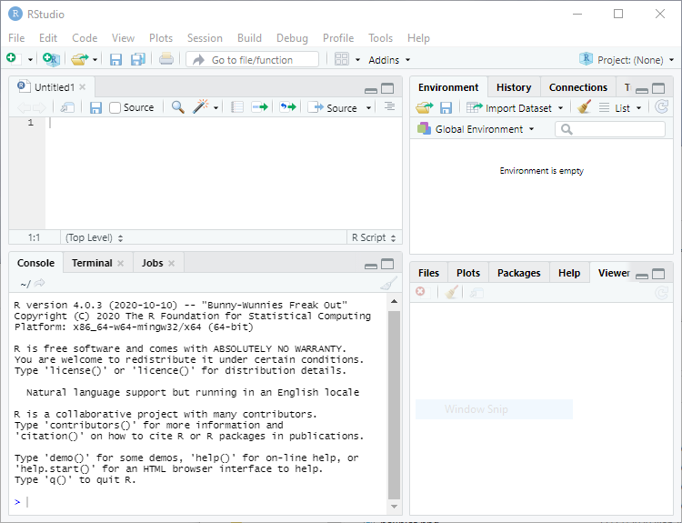

```{r include=FALSE}
knitr::opts_chunk$set(comment = NA, prompt = TRUE)
```


```{=html}
<div class="lead"><small>
The purpose of these notes is to provide a quick introduction to R,
particularly as a tool for fitting linear and generalized linear models.
A PDF version is available <a href="introducingR.pdf">here</a>. The web 
pages and PDF were created using <code>markdown</code> as explained in 
the last section. You will find many applications in the computing logs 
for the statistics courses on this site.</small></div>
```

# 1 Introduction

R is a powerful environment for statistical computing which runs on several 
platforms. These notes are written specially for users running the Windows 
version, but most of the material applies to the Mac and Linux versions as well.
Following some bibliographic remarks and tips for getting started, 
I describe reading and examining data, and fitting linear and generalized 
linear models. I close with a few pointers and references on where to go 
from here. I have tried to introduce key features of R as needed by 
students in my statistics classes. As a result, I often postpone (or
altogether omit) discussion of some of the more powerful features of R
as a programming language.


## 1.1 The R Language and environment

R was first written as a research project by Ross Ihaka and Robert Gentleman, 
and is now under active development by a group of statisticians called 'the R 
core team', with a home page at <https://www.r-project.org>.

R was designed to be 'not unlike' the S language developed by John Chambers and 
others at Bell Labs. A commercial version of S with additional features was 
developed and marketed as S-Plus by Statistical Sciences, eventually becoming 
part of TIBCO Spotfire. You can view R and S-Plus as alternative 
implementations of the same underlying S language. The modern R implementation, 
however, is by far the most popular.

R is available free of charge and is distributed under the terms of the 
[Free Software Foundation](http://www.gnu.org/)'s [GNU General Public  License](
http://www.gnu.org/licenses/gpl-3.0.html). 
You can download the program from the [Comprehensive R Archive Network 
(CRAN)](http://lib.stat.cmu.edu/R/CRAN/mirrors.html). Ready-to-run 'binaries' 
are available for Windows, Mac OS, and Linux. The source code is also available 
for download and can be compiled for other platforms.


## 1.2 Bibliographic Remarks

S was first introduced by Becker and Chambers [-@beckerChambers1984] in what's 
known as the 'brown' book. The new S language was described by Becker, Chambers 
and Wilks [-@beckerChambersWilks1988] in the 'blue' book. Chambers and Hastie 
[-@chambersHastie1992] edited a book discussing statistical modeling in S, 
called the 'white' book. The latest version of the S language is described by 
@chambers1998 in the 'green' book, but R is largely an implementation of the 
versions documented in the blue and white books. Chamber's latest books, 
@chambers2008 and @chambers2016, focus on programming with R.

Venables and Ripley -@venablesRipley2002 have written an excellent book on 
Modern Applied Statistics with S-PLUS that is now in its fourth edition. The 
latest edition is particularly useful to R users because the main text explains 
differences between S-Plus and R where relevant. A companion volume called *S 
Programming* appeared in 2000 and applies to both S-Plus and R 
[@venablesRipley2000]. These authors have also made available in their website 
an extensive collection of complements to their books, follow the links at 
[MASS 4](http://www.stats.ox.ac.uk/pub/MASS4/).

There is now an extensive and rapidly growing literature on R. Good 
introductions include the books by @krauseOlson1997, @dalgaard2008, and 
@braunMurdoch2016. Beginners will probably benefit from working through the 
examples in @hothornEveritt2014 *A Handbook of Statistical Analyses Using R*, 
now in its third edition, or @fox2002's companion to applied regression. Among 
more specialized books my favorites include @murrell2006, an essential 
reference on R graphics, @pinheiroBates2000, a book on mixed models, and 
@therneauGrambsch2000's  book on survival models. (Therneau wrote the survival 
analysis code used in S-Plus and R.) 

Hadley Wickham has made a number of ground-breaking contributions to R that 
deserve special mention.He is the author of the `ggplot2` package 
[@wickham2016], a very popular graphics package that has brought to R the 
grammar of graphics proposed by  @wilkinson2005. He has also contributed a 
number of data-management packages, of which the most notable is `dplyr`, and 
has advocated the use of "tidy" datasets. His approach to  data management is 
explained in detail in @wickhamGrolemund2017, with its own website at 
<https://www.tidyverse.org/>.  He has also written an advanced book on 
programming R, now in its second edition (@wickham2019). You will find most of 
his work available online; follow the links in the list of references at the 
end of this tutorial.  

The official R manuals are distributed as PDF files. These include 
*An Introduction to R* (a nice 100-page introduction), a manual on 
*R Data Import/Export* describing facilities for transferring data to and from 
other packages, and useful notes on *R installation and Administration*. 
More specialized documents include a draft of the *R Language Definition*, 
a guide to *Writing R Extensions*, documentation  on *R Internals* including 
coding standards, and finally the massive *R  Reference Index* (~3000 pages). 
The online help facility is excellent. For additional references see the 
annotated list at [R Books](https://www.r-project.org/doc/bib/R-books.html).

```{=html}
<p class="pull-right">Continue with <a href="gettingStarted" class="btn btn-default">
Getting Started</a></p>
```

# 2 Getting Started

Obviously the first thing you need to do is download a copy of R. This tutorial
was created using version 4.0.3, released in October 2020. New releases occur every 
six months or so. You will find the latest version and binaries for Windows, Mac OS X, 
and Linux in the [Comprehensive R Archive Network](https://cran.r-project.org/). 
Find the  mirror nearest you and follow the links. The Windows installer is fairly 
easy to use and, after agreeing to the license terms, lets you choose which 
components you want to install. Additional packages can always be installed 
directly from R at a later time. 

The next thing you should do is install R Studio, a nice Integrated Development 
Environment (IDE) for R, that is available for Windows, Mac OS X, and Linux. 
You can download the free open source edition of R Studio Desktop from 
<https://rstudio.com/products/rstudio/>. Once the software is installed, it 
will find and  integrate your R installation. 


\includegraphics[width=\textwidth]{RStudioIDE.png}

The panel on the lower-left corner of the IDE shows the console, which is
described below.  Graphs and help will appear on the bottom right panel. 
The panel on the top left can be used to type an R script to be run later. 

If you do not install R Studio, you can still run the R graphical user 
interface (GUI). I recommend that you create a shorcut on the  desktop.
When R starts you see a console. Graphs appear on a separate window.

## 2.1 The Console

The console in R Studio (or R) is where you  type R expressions and see text 
results.  You are prompted to type some input with the greater than symbol. 
To quit R Studio (and R) type

```{.r}
> q()
```

Note the parentheses after the `q`. This is because in R you do not type 
commands, but rather call *functions* to achieve results, even quit! To call a 
function you type the name followed by the arguments in parentheses. If the 
function takes no arguments, you just type the name followed by left and right 
parenthesis. (If you forget the parentheses and type just the name of the 
function, R will list the source code.)  After typing `q()` you are asked 
whether you want to save the current work environment. You can skip this prompt 
by typing `q("no")`.

You should also know about the `help()` function, which uses the window on the 
bottom right (opens a separate help window in R). The function can be called 
with arguments to obtain help about specific features of R, for example 
`help(plot)`.  A shortcut for help on a topic is a question mark followed by 
the topic, as in `?plot`.  

The console allows input editing.  You will find that the left and right arrow 
keys, home, end, backspace, insert, and delete work exactly as you would 
expect. You also get an input history: the up and down arrow keys can be used 
to scroll through recent input lines. Thus, if you make a mistake, all you need 
to do is press the up key to recall your last expression and edit it.

You can also type a script on the top left window of R Studio and then click on 
"Run".

## 2.2 Expressions and Assignments

R works like a calculator, you type an expression and get the answer:

```{r}
1 + 2
```

The standard arithmetic operators are `+`, `-`, `*`, and `/` for add, subtract, 
multiply and divide, and `^` for exponentiation, so `2^3 = 8`. These operators 
have the standard precedence, with exponentiation highest and 
addition/subtraction lowest, but you can always control the order of evaluation 
with parentheses. You can use mathematical functions, such as `sqrt()`, 
`exp()`, and `log()`. For example

```{r}
log(0.3/(1 - 0.3))
```

R also understands the relational operators `<=`, `<`, `==`, `>`, `>=` and `!=` 
for less than or equal, less than, equal, greater than, greater than or equal, 
and not equal. These can be used to create logical expressions that take values 
`TRUE` and `FALSE` (or `T` and `F` for short). Logical expressions may be 
combined with the logical operators `|` for OR and `&` for AND, as 
shown further below.

The results of a calculation may be assigned to a named object. The assignment 
operator in R is `<-`, read as "gets", but by popular demand R now accepts the 
equal sign as well, so `x <- 2` and `x = 2` both assign the value 2 to a 
variable (technically an object) named `x`.

Typing a name prints its contents. The name `pi` is used for the constant 
$\pi$. Thus,

```{r}
s = pi/sqrt(3)
```

assigns $\pi/\sqrt{3}$ to the variable `s` and prints its value.

Names may contain letters, numbers or periods, and (starting with 1.9.0) the 
underscore character, but must start with a letter or period. (I recommend you 
always start names with a letter.) Thus, `v.one` and `v_one` are valid names, 
but `v one` is not (because it includes a space).

*Warning*: R is case sensitive, `v.one`, `V.one` and `v.One` are all different 
names.

R objects exist during your session but vanish when you exit. However, as noted 
earlier you will be asked if you want to save an image of your workspace before 
you leave. You can also save individual objects to disk, see `help(save)`.

Note that assignments are expressions too; you can type x <- y <- 2 and both x 
and y will get 2. This works because the assignment y <- 2 is also an 
expression that takes the value 2.

*Exercise*: What's the difference between `x == 2` and `x = 2`? Use the console 
to find out.

## 2.3 Vectors and Matrices

So far we have worked with scalars (single numbers) but R is designed to work 
with __vectors__ as well. The function `c()`, which is short for catenate (or 
concatenate if you prefer) can be used to create vectors from scalars or other 
vectors

```{r}
x <- c(1, 3, 5, 7)
x
```

The colon operator `:` can be used to generate a sequence of numbers

```{r}
x <- 1:10
x
```

You can also use the `seq()` function to create a sequence given the starting 
and stopping points and an increment. For example here are eleven values 
between 0 and 1 in steps of 0.1:

```{r}
seq(0, 1, 0.1)
```

Another function that is useful in creating vectors is `rep()` for repeat or 
replicate. For example `rep(3, 4)` replicates the number three four times. The 
first argument can be a vector, so `rep(x, 3)` replicates the entire vector `x` 
three times. If both arguments 
are vectors of the same size, then each element of the first vector is 
replicated the number of times indicated by the corresponding element in the 
second vector. Consider this example:

```{r}
rep(1:3, 2)
rep(1:3, c(2, 2, 2))
```

The first call repeats the vector `1:3` twice. The second call repeats each 
element of `1:3` twice, and could have been written `rep(1:3, rep(2, 3)`), a 
common R idiom.

R operations are vectorized. If `x` is a vector, then `log(x)` is a vector with 
the logs of the elements of `x`. Arithmetic and relational operators also work 
element by element. If `x` and `y` are vectors of the same length, then `x + y` 
is a vector with elements equal to the sum of the corresponding elements of `x` 
and `y`. If `y` is a scalar, it is added to each element of `x`. 
If `x` and `y` are vectors of different lengths, the shorter one is recycled as 
needed, perhaps a fractional number of times (in which case you get a warning).

The logical operators `|` for *or* and `&` for *and* also work element by 
element. (The double operators `||` for *or* and `&&` for *and* work only on 
the first element of each vector, and use shortcut evaluation; they are used 
mostly in writing R functions, and will not be discussed further.)

```{r}
a = c(TRUE, TRUE, FALSE, FALSE)
b = c(TRUE, FALSE, TRUE, FALSE)
a & b
```

The number of elements of a vector is returned by the function `length()`. 
Individual elements are addressed using subscripts in square brackets, so 
`x[1]` is the first element of `x`, `x[2]` is the second, and `x[length(x)]` is 
the last.

The subscript can be a vector itself, so `x[1:3]` is a vector consisting of the 
first three elements of `x`. A negative subscript *excludes* the corresponding 
element, so `x[-1]` returns a vector with all elements of `x` except the first 
one.

Interestingly, a subscript can also be a logical expression, in which case you 
get the elements for which the expression is `TRUE`. For example, to list the 
elements of `x` that are less than `5` 
we write

```{r}
x[x < 5]
```

I read this expression "x such that x is less than 5". That works because the 
subscript `x < 5` is this vector

```{r}
x < 5
```

R's subscripting facility is extremely powerful.  You may find that it takes a 
while to get used to it, but eventually the language becomes natural.

R also understands __matrices__ and higher dimensional arrays.  The following 
function creates a 3 by 4 matrix and fills it by columns with the numbers 1 to 
12:

```{r}
M = matrix(1:12, 3, 4)
M
```

The elements of a matrix may be addressed using the row and column subscripts 
in square brackets, separated by a command. Thus, `M[1, 1]` is the first 
element of `M` (in row 1 and column 1).

A subscript may be left blank to select an entire row or column: `M[1,]` is the 
first row, and `M[,1]` is the first column.  Any of the subscripts may be a 
vector, so `M[1:2, 1:2]` is the upper-left 2 by 2 corner of `M`. Try it.

The number of rows and columns of a matrix are returned by the functions 
`nrow()` and `ncol()`. To transpose a matrix use the function `t()`. The matrix 
multiplication operator is `%*%`. Matrix inversion is done by the function 
`solve()`. See the linear regression section for an example.

*Exercise*: How do you list the last element of a matrix?

## 2.4 Simple Graphs

R has very extensive and powerful graphic facilities. In the example below we 
use `seq()` to create equally spaced points between -3 and 3 in steps of 0.1 
(that's 61 points). Then we call the function `dnorm()` to calculate the 
standard normal density evaluated at those points, we plot it, and add a title 
in a nice shade of blue. Note that we are able to add the title to the current 
plot in a separate call.

```{r}
z = seq(-3, 3, 0.1)
d = dnorm(z)
```

```{.r}
> plot(z, d, type="l")
> title("The Standard Normal Density", col.main="#3366cc")
```

```{r include=FALSE}
png(filename = "dnorm.png", width=350, height=300)
par (mar=c(3,3,2,1), mgp=c(2,.7,0), tck=-.01)
plot(z, d, type="l")
title("The Standard Normal Density", col.main="#3366cc")
dev.off()
```


```{=latex}
\begin{wrapfigure}{r}{0.4\textwidth}
\includegraphics[width=0.35\textwidth,keepaspectratio]{dnorm.png}
\end{wrapfigure}
```

Arguments to a function can be specified by position or by name. The `plot()` 
function expects the first two arguments to be vectors giving the `x` and `y` 
coordinates of the points to be plotted. We also specified the `type` of plot. 
Since this is one of many optional parameters (type `?plot` for details), we 
specified it by name as `type="l"` (the letter el). This indicates that we want 
the points joined to form a line, rather than the default which is to plot 
discrete points. Note that R uses the equal sign to specify named arguments to 
a function.

The `title()` function expects a character string with the title as the first 
argument. We also specified the optional argument `col.main="#3366c"` 
to set the color of the title. Here I specified the red, green and blue 
components of the color in hexadecimal notation; this particular choice 
matches the headings on my website. There are also 657 named colors to choose 
from, type `colors()` to see their names.

The next example is based on a demo included in the R distribution, and is 
simply meant to show off R's use of colors. We use the `pie()` function to 
create a chart with 16 slices. The slices are all the same width, but we fill 
them with different colors obtained using the `rainbow()` function.

```{.r}
> pie(rep(1, 16), col = rainbow(16))
```

```{r include=FALSE}
png(filename = "pie.png", width=300, height=300)
par (mar=c(3,3,2,1), mgp=c(2,.7,0), tck=-.01)
pie(rep(1, 16), col = rainbow(16))
dev.off()
```


```{=latex}
\begin{wrapfigure}{l}{0.4\textwidth}
\includegraphics[width=0.35\textwidth,keepaspectratio]{pie.png}
\end{wrapfigure}
```

Note the use of the rep function to replicate the number one 16 times. To see 
how one can specify colors and labels for the slices, try calling pie with 
arguments `1:4`, `c("r", "g", "b","w")` and `col = 
c("red,"green","blue","white")`.

To save a graph in R Studio click on the "Export" button on the graph window. 
(In R make sure the focus is on the graph window and choose `File | Save as`, 
from the menu.)  You can save as an Image or a PDF file. 

One of the image formats is `png`, which makes it easy to include R graphs in 
web pages. R also supports `jpeg`, but I think `png` is better than `jpeg` for 
statistical plots. All graphs on the web version of this tutorial are in `png` 
format.

Alternatively, you can copy the graph to the clipboard by choosing "Clipboard". 
(In R select `File | Copy to clipboard`.) You get a choice of two formats: 
bitmap and metafile. I recommend that you use the metafile format because it's 
more flexible. You can then paste the graph into a word processing or 
spreadsheet document. (In R you can also print the graph using `File | Print`).

*Exercise*: Simulate 20 observations from the regression model $Y = \alpha + 
\beta x + e$ using the `x` vector generated above. Set $\alpha = 1$ and $\beta 
= 2$. Use standard normal errors generated as `rnorm(20)`, where 20 is the 
number of observations.

```{=html}
<p class="pull-right">Continue with <a href="readingData" class="btn btn-default">
Reading Data</a></p>
```

# 3 Reading and Examining Data

R can handle several types of data, including numbers, character strings, 
vectors and matrices, as well as more complex data structures. In this section 
I describe **data frames**, the preferred way to organize data for statistical 
analysis, explain how to read data from an external file into a data frame, and 
show how to examine the data using simple descriptive statistics and 
informative plots.

## 3.1 Lists and Data Frames

An important data structure that we have not discussed so far is the **list**. 
A list is a set of objects that are usually named and can be anything: numbers, 
character strings, matrices or even lists.

Unlike a vector, whose elements must all be of the same type (all numeric, or 
all character), the elements of a list may have different types. Here's a list 
with two components created using the function `list()`:

```{r}
person = list(name="Jane", age=24)
```

Typing the name of the list prints all elements. 

```{r}
person
```

You can extract a component of a list using the extract operator `$`. For 
example we can list just the `name` or `age` of this person:

```{r}
person$name
person$age
```

Individual elements of a list can also be accessed using their indices or their 
names as subscripts. For example we can get the name using `person[1]` or 
`person["name"]`. (You can use single or double square brackets depending on 
whether you want a list with the name, which is what we did, or just the name, 
which would require double brackets as in `person[[1]]` or `person[["name"]]`. 
The distinction is not important at this point.)

A **data frame** is essentially a rectangular array containing the values of 
one or more variables for a set of units. The frame also contains the names of 
the variables, the names of the observations, and information about the nature 
of the variables, including whether they are numerical or categorical.

Internally, a data frame is a special kind of list, where each element is a 
vector of observations on a variable. Data frames look like matrices, but can 
have columns of different types. This makes them ideally suited for 
representing datasets, where some variables can be numeric and others can be 
categorical.

Data frames (like matrices) can also accommodate missing values, which are 
coded using the special symbol `NA`. Most statistical procedures, however, omit 
all missing values.

Data frames can be created from vectors, matrices or lists using the function 
data.frame, but more often than not one will read data from an external file, 
as shown in the next two sections.

## 3.2 Free-Format Input

Free-format data are text files containing numbers or character strings 
separated by spaces. Optionally the file may have a header containing variable 
names. Here's an excerpt of a data file containing information on three 
variables for 20 countries in Latin America:
  
```
setting  effort   change
Bolivia            46       0        1
Brazil             74       0       10
Chile              89      16       29
  ... lines omitted ...
Venezuela          91       7       11
```


This small dataset includes an index of social setting, an index of family 
planning effort, and the percent decline in the crude birth rate between 1965 
and 1975. The data are available on this website in a file called `effort.dat` 
that includes a header with the variable names.

R can read the data directly from the web:
  
```{r}
fpe = read.table("https://grodri.github.io/datasets/effort.dat")
```

The function used to read data frames is `read.table()`. The argument is a 
character string giving the name of the file containing the data, but here we 
have given it a fully qualified url (uniform resource locator), and that's all 
it takes.

Alternatively, you could download the data and save them in a local file, or 
just cut and paste the data from the browser to an editor, and then save them. 
Make sure the file ends up in R's working directory, which you can find out by 
typing `getwd()`. If that is not the case, you can use a fully qualified path 
name or change R's working directory by calling `setwd()` with a string 
argument. Remember to double up your backward slashes (or use forward slashes 
instead) when specifying paths in Windows.

Here we assigned the data to an object called `fpe`. R's "official"" assignment 
operator is `<-` but I prefer `=`. Yo print the object simply type its name

```{r}
fpe
```

In this example R detected correctly that the first line in our file was a 
header with the variable names. It also inferred correctly that the first 
column had the observation names. (Well, it did so with a little help; I made 
sure the row names did not have embedded spaces, hence `CostaRica`. 
Alternatively, I could have used `"Costa Rica"` in quotes as a row name.)

You can always tell R explicitly whether or not you have a header by specifying 
the optional argument `header=TRUE` or `header=FALSE` to the `read.table()` 
function. This is important if you have a header but lack row names, because 
R's guess is based on the fact that the header line has one fewer entry than 
the next row, as it did in our example.

If your file does not have a header line, R will use the default variable names 
`V1`, `V2`, ..., etc. To override this default use `read.table()`'s optional 
argument `col.names` to assign variable names. This argument takes a vector of 
names. So, if our file did *not* have a header we could have used the command

```{.r}
> fpe = read.table("noheader.dat", col.names=c("setting","effort","change"))
```

Don't worry if this command doesn't fit in a line. R code can be continued 
automatically in a new line simply by making it obvious that we are not done, 
for example ending the line with a comma, or having an unclosed left 
parenthesis. R responds by prompting for more with the continuation symbol `+` 
instead of the usual prompt `>`.

If your file does not have observation names, R will simply number the 
observations from 1 to n. You can specify row names using `read.table()'s 
optional argument `row.names`, which works just like `col.names`; type 
`?data.frame` for more information. (I should mention that in a "tidy" world 
row names should just be another column, but classic R treats them as 
observation indices.)

There are two closely related functions that can be used to get or set variable 
*and* observation names at a later time. These are called `names()`, for the 
variable or column names, and `row.names()` for the observation or row names. 
Thus, if our file did not have a header we could have read the data and then 
changed the default variable names using the `names()` function:

```{.r}
> fpe = read.table("noheader.dat")
> names(fpe) = c("setting","effort","change")
```

*Technical Note*: If you have a background in other programming languages, you 
may be surprised to see a function call on the left hand side of an assignment. 
These are special 'replacement' functions in R. They extract an element of an 
object and then replace its value.

In our example all three-variables were numeric. R will handle string variables 
with no problem. If one of our variables was sex, coded `M` for males and `F` 
for females, R would have created a *factor*, which is basically a categorical 
variable that takes one of a finite set of values called *levels*. In Section 5 
we will use a data frame with categorical variables to illustrate logistic 
regression. Another way to generate factors is by grouping a numeric covariate. 
An example appears in Section 4 below.

*Exercise*: Use a text editor to create a small file with the following three 
lines:

```
a b c
1 2 3
4 5 6
```

Read this file into R so the variable names are `a`, `b` and `c`. Now delete 
the first row in the file, save it, and read it again into R so the variable 
names are still `a`, `b` and `c`.

## 3.3 Fixed-Format Input

Suppose the family planning effort data had been stored in a file containing 
only the actual data (no country names or variable names) in a fixed format, 
with social setting in character positions (often called columns) 1-2, family 
planning effort in positions 3-4 and fertility change in positions 5-6. This is 
a fairly common way to organize large datasets.

The following call will read the data into a data frame and name the variables:

```{.r}
> fpe = read.table("fixedformat.dat",  col.names = c("setting", "effort", 
"change"), sep=c(1, 3, 5))
```

Here I assume that the file in question is called `fixedformat.dat`. I assign 
column names just as before, using the `col.names` parameter. The novelty lies 
in the next argument, called `sep`, which is used to indicate how the variables 
are separated. The default is white space, which is appropriate when the 
variables are separated by one or more blanks or tabs. If the data are 
separated by commas, a common format with spreadsheets, you can specify `sep = 
","`. Here I created a vector with the numbers 1, 3 and 5 to specify the 
character position (or column) where each variable starts. Type `?read.table` 
for more details.

## 3.4 Printing Data and Summaries

You can refer to any variable in the `fpe` data frame using the extract 
operator `$`. For example to look at the values of the fertility change 
variable, type

```{r}
fpe$change
```

and R will list a vector with the values of change for the 20 countries. You 
can also define `fpe` as your default dataset by "attaching" it to your session:

```{.r}
> attach(fpe)
```

If you now type the name `effort` by itself, R will now look for it in the 
`fpe` data frame. If you are done with a data frame, you can detach it using 
`detach(fpe)`.  While `attach()` can save typing, experience has shown that it 
can also lead to problems, suggesting it is best avoided. For example, if you 
already have an object named `effort`, that will mask the object in `fpe`.  My 
advice is to always specify the data frame name, as we do below.

To obtain simple descriptive statistics on these variables try the `summary()` 
function:

```{r}
summary(fpe)
```

As you can see, we get the min and max, 1st and 3rd quartiles, median and mean. 
For categorical variables you get a table of counts. Alternatively, you may ask 
for a summary of a specific variable. Or use the functions `mean()` and `var()` 
for the mean and variance of a variable, or `cor()` for the correlation between 
two variables, as shown below:

```{r}
mean(fpe$effort)
cor(fpe$effort, fpe$change)
```

Elements of data frames can be addressed using the subscript notation 
introduced in Section 2.3 for vectors and matrices. For example to list the 
countries that had a family planning effort score of zero we can use

```{r}
fpe[fpe$effort == 0, ]
```

This works because the expression `fpe$effort == 0` selects the rows 
(countries) where the effort score is zero, while leaving the column subscript 
blank selects all columns (variables). 

The fact that the rows are named allows yet another way to select elements: by 
name. Here's how to print the data for Chile:

```{r}
fpe["Chile", ]
```

*Exercise*: Can you list the countries where social setting is high (say above 
80) but effort is low (say below 10)? Hint: recall the element-by-element 
logical operator `&`.

## 3.5 Plotting Data


```{=latex}
\begin{wrapfigure}{r}{0.35\textwidth}
\includegraphics[width=0.3\textwidth,keepaspectratio]{boxplot.png}
\end{wrapfigure}
```

Probably the best way to examine the data is by using graphs. Here's a boxplot 
of setting. Inspired by a demo included in the R distribution, I used custom 
colors for the box ("lavender", specified using a name R recognizes) and the 
title (`#3366CC`).

As noted earlier, R can save a plot as a png or jpeg file, so that it can be 
included directly on a web page. Other formats available are postscript for 
printing and windows metafile for embedding in other applications. Note also 
that you can cut and paste a graph to insert it in another document.

```{r include=FALSE}
png("boxplot.png", width=350, height=400)
par (mar=c(3,3,2,1), mgp=c(2,.7,0), tck=-.01)
boxplot(fpe$setting, col = "lavender")
title("Boxplot of Setting", col.main="#3366CC")
dev.off()
```

```{.r}
> boxplot(fpe$setting, col="lavender")
> title("Boxplot of Setting", col.main="#3366CC")
```

Here's a scatterplot of change by effort, so you can see what a correlation of 
0.80 looks like:

```{.r}
> plot(fpe$effort, fpe$change, pch=21, bg="gold")
> title("Scatterplot of Change by Effort", col.main="#3366CC")
```

```{r include=FALSE}
png("scatterplot.png", width=600)
plot(fpe$effort, fpe$change, pch=21, bg="gold")
title("Scatterplot of Change by Effort", col.main="#3366CC")
dev.off()
```


\centerline{\includegraphics[width=0.6\textwidth,keepaspectratio]{scatterplot.png}}

I used two optional arguments that work well together: `pch=21` selects a 
special plotting symbol, in this case a circle, that can be colored and filled; 
and `bf="gold" selects the fill color for the symbol. I left the perimeter 
black, but you can change this color with the `col` argument.

To identify points in a scatterplot use the `identify()` function. Try the 
following on the graph window:

```{.r}
> identify(fpe$effort, fpe$change, row.names(fpe), ps = 9)
```

The first three parameters to this function are the x and y coordinates of the 
points and the character strings to be used in labeling them. The `ps` optional 
argument specifies the size of the text in points; here I picked 9-point labels.

Now click within a quarter of an inch of the points you want to identify.
R Studio will note that "locator is active". When you are done clicking press 
the `Esc` key. The labels will then appear next to the points you clicked on. 
(If you are using the R GUI, the labels will appear as you click on the 
points.) 

Which country had the most effort but only moderate change? Which one had the 
most change?

Another interesting plot to try is `pairs()`, which draws a scatterplot matrix. 
In our example try


```{.r}
pairs(fpe)
title("Scatterplots for Setting, Effort and Change", col.main="#3366cc")
```

```{r include = FALSE}
png("pairs.png", width = 750)
par (mar=c(3,3,2,1), mgp=c(2,.7,0), tck=-.01)
pairs(fpe)
title("Scatterplots for Setting, Effort and Change", col.main="#3366cc")
dev.off()
```


\centerline{\includegraphics[width=\textwidth]{pairs.png}}

The result is a 3 by 3 matrix of scatterplots, with the variable names down the 
diagonal and plots of each variable against every other one.

Before you quit this session consider saving the `fpe` data frame. To do this 
use the `save()` function

```{r}
save(fpe, file="fpe.Rdata")
load("fpe.Rdata")
```

The first argument specifies the object to be saved, and the `file` argument 
provides the name of a file, which will be in the working directory unless a 
full path is given. (Remember to double-up your backslashes in Windows, or use 
forward slashes instead.)

By default R saves objects using a compact binary format which is portable 
across all R platforms. There is an optional argument `ascii` that can be set 
to `TRUE` to save the object as ASCII text. This option was handy to transfer R 
objects across platforms, but is no longer needed.

You can also save an image of your entire workspace, including all objects you 
have defined, and then load everything again, using

```{.r}
> save.image(file = "workspace.Rdata")
> load("workspace.Rdata")
```

In R Studio you can also do this using the Environment tab on the top right; 
click on the floppy disk image to save the workspace, or on the folder with an 
arrow to load a workspace. (In the R Gui you can use the main menu; choose 
`File|Save` and `File|Load`.)

When you quit R using `q()` you will be prompted to save the workspace, unless 
you skip this safeguard by typing `q("no")`.

*Exercise*:  Use R to create a scatterplot of change by setting, cut and paste 
the graph into a document in your favorite word processor, and try resizing and 
printing it. I recommend that you use the windows metafile format for the cut 
and paste operation.

```{=html}
<p class="pull-right">Continue with <a href="linearModels" class="btn btn-default">
Linear Models</a></p>
```
# 4 Linear Models

Let us try some linear models, starting with multiple regression and analysis 
of covariance models, and then moving on to models using regression splines. In 
this section I will use the data read in Section 3, so make sure the `fpe` data 
frame is still available.

## 4.1 Fitting a Model

To fit an ordinary linear model with fertility change as the response and 
setting and effort as predictors, try

```{r}
lmfit = lm( change ~ setting + effort, data = fpe )
```

Note first that `lm()` is a function, and we assign the result to an object 
that I choose to call `lmfit` (for linear model fit). This stores the results 
of the fit for later examination.

The first argument to `lm()` is a model formula, which has the response on the 
left of the tilde `~` (read "is modeled as"), and a Wilkinson-Rogers model 
specification formula on the right. R uses

`+`	to combine elementary terms, as in `A + B`
`:`	for interactions, as in `A:B`;
`*`	for both main effects and interactions, so `A * B = A + B + A:B`


A nice feature of R is that it lets you create interactions between categorical 
variables, between categorical and continuous variables, and even between 
numeric variables (it just creates the cross-product).

We also used the `data` argument to specify the data frame containing these 
variables. 

## 4.2  Examining a Fit

Let us look at the results of the fit. One thing you can do with `lmfit`, as 
you can with any R object, is print it.

```{r}
lmfit
```

The output includes the model formula and the coefficients. You can get a bit 
more detail by using the `summary()` function:

```{r}
summary(lmfit)
```

The output includes a more conventional table with parameter estimates and 
standard errors, as well the residual standard error and multiple R-squared. 
(You could also get the matrix of correlations among parameter estimates, by 
adding the option `correlation = TRUE` in the call to `summary()`, but that is 
a bit too much detail.)

To get a hierarchical analysis of variance table corresponding to introducing 
each of the terms in the model one at a time, in the same order as in the model 
formula, try the `anova()` function:

```{r}
anova(lmfit)
```

Alternatively, you can plot the results using

```{.r}
plot(lmfit)
```

This will produce a set of four plots: residuals versus fitted values, a Q-Q 
plot of standardized residuals, a scale-location plot (square roots of 
standardized residuals versus fitted values, and a plot of residuals versus 
leverage, that adds bands corresponding to Cook's distances of 0.5 and 1.

R Studio (and R) will prompt you to press Enter before showing each graph, but 
we can do better. Type `par(mfrow = c(2, 2))` to set your graphics window to 
show four plots at once, in a layout with 2 rows and 2 columns. Then redo te 
graph using `plot(lmfit)`. To go back to a single graph per window use 
`par(mfrow = c(1, 1))`. There are many other ways to customize your graphs by 
setting high-level parameters, type `?par` to learn more.

```{r include=FALSE}
png("lmfit.png", width = 750)
par(mfrow = c(2, 2))
plot(lmfit)
dev.off()
```


\includegraphics[width=\textwidth,keepaspectratio]{lmfit.png}

*Technical Note*: You may have noticed that we have used the function `plot()` 
with all kinds of arguments: one or two variables, a data frame, and now a 
linear model fit. In R jargon,  `plot()` is a generic function. It checks for 
the kind of object that you are plotting, and then calls the appropriate (more 
specialized) function to do the work. There are actually many plot functions in 
R, including `plot.data.frame()` and `plot.lm()`. For most purposes, the 
generic function will do the right thing and you don't need to be concerned 
about its inner workings.

## 4.3  Extracting Results

There are some specialized functions that allow you to extract elements from a 
linear model fit. For example

```{r}
fitted(lmfit)
```

extracts the fitted values. In this case it will also print them, because we 
did not asign them to anything. (The longer form `fitted.values()` is an alias.)

To extract the coefficients use the `coef()` function (or the longer form 
`coefficients()`)

```{r}
coef(lmfit)
```

To get the residuals, use the `resids()` function (or the longer form 
`residuals()`). There is a `type` argument that lets you choose several
types of residuals, type `?residuals.lm` for information. I find more
useful the `rstudent()` functions that returns standardized residuals:


```{r}
rstudent(lmfit)
```

If you are curious to see exactly what a linear model fit produces, try the 
function

```{r}
names(lmfit)
```

which lists the named components of a linear fit. All of these objects may be 
extracted using the `$` operator. However, if there is a special extractor 
function such as `coef()` or `resid()`, you are encouraged to use it.

## 4.4 Factors and Covariates

So far our predictors have been continuous variables or *covariates*. We can 
also use categorical variables or *factors*. Let us group family planning 
effort into three categories:

```{r}
fpe$effortg = cut(fpe$effort, breaks = c(-1, 4, 14, 100), 
  label = c("weak", "moderate", "strong"))
```


The function `cut()` creates a factor or categorical variable. The first 
argument is an input vector, the second is a vector of breakpoints, and the 
third is a vector of category labels. Note that there is one more breakpoint 
than there are categories. All values greater than the *i*-th breakpoint and 
less than or equal to the *(i+1)*-st breakpoint go into the *i*-th category. 
Any values below the first breakpoint or above the last one are coded `NA` (a 
special R code for missing values). If the labels are omitted, R generates a 
suitable default of the form "(a, b]". By default the intervals are closed on 
the right, so our intervals are  $\le 4$, 5 - 14, and 15+. To change this 
behavior, use the option `right = FALSE`. 

Note that by specifying `fpe$effortg` on the left-hand-side, we have 
effectively added a new column to the `fpe` data frame.

Try fitting the analysis of covariance model:

```{r}
covfit = lm( change ~ setting + effortg, data = fpe)
covfit
```

As you can see, `effortg` has been treated automatically as a factor, and R has 
generated the necessary dummy variables for "moderate" and "strong" programs, 
treating "weak"" as the reference cell.

*Choice of Contrasts*: R codes unordered factors using the reference cell or 
"treatment contrast" method. The reference cell is always the first category 
which, depending on how the factor was created, is usually the first in 
alphabetical order. If you don't like this choice, R provides a special 
function to re-order levels, check out `help(relevel)`.

You can obtain a hierarchical anova table for the analysis of covariance model 
using the `anova()` function:

```{r}
anova(covfit)
```

Type `?anova` to learn more about this function.

## 4.5 Regression Splines

The real power of R begins to shine when you consider some of the other 
functions you can include in a model formula. First, you can include 
mathematical functions, for example `log(setting)` is a perfectly legal term in 
a model formula. You don't have to create a variable representing the log of 
setting and then use it, R will create it 'on the fly', so you can type

```{r}
lm( change ~ log(setting) + effort, data = fpe)
```

If you wanted to use orthogonal polynomials of degree 3 on setting, you could 
include a term of the form `poly(setting, 3)`.

You can also get R to calculate a well-conditioned basis for regression 
splines. First you must load the `splines` library.

```{r}
library(splines)
```

This makes available the function `bs()~ to generate B-splines. For example the 
call

```{r}
fpe$setting.bs = bs(fpe$setting, knots = c(66, 74, 84))
```

will generate cubic B-splines with interior knots placed at 66, 74 and 84. This 
basis will use seven degrees of freedom, four corresponding to the constant, 
linear, quadratic and cubic terms, plus one for each interior knot. 
Alternatively, you may specify the number of degrees of freedom you are willing 
to spend on the fit using the parameter `df`. For cubic splines R will choose 
df-4 interior knots placed at suitable quantiles. You can also control the 
degree of the spline using the parameter `degree`, the default being cubic.

If you like natural cubic splines, you can obtain a well-conditioned basis 
using the function `ns()`, which has exactly the same arguments as `bs()` 
except for `degree`, which is always three. To generate a natural spline with 
five degrees of freedom, use the call

```{r}
fpe$setting.ns = ns(fpe$setting, df=5)
```

Natural cubic splines are better behaved than ordinary splines at the extremes 
of the range. The restrictions mean that you save four degrees of freedom. You 
will probably want to use two of them to place additional knots at the 
extremes, but you can still save the other two.

To fit an additive model to fertility change using natural cubic splines on 
setting and effort with only one interior knot each, placed exactly at the 
median of each variable, try the following call:

```{r}
splinefit = lm( change ~ ns(setting, knot=median(setting)) + 
  ns(effort, knot=median(effort)), data = fpe )
```


Here we used the parameter `knot` to specify where we wanted the knot placed, 
and the function `median()` to calculate the median of setting and effort. All 
calculations are done "on the fly".

Do you think the spline model is a good fit? Natural cubic splines with exactly 
one interior knot require the same number of parameters as an ordinary cubic 
polynomial, but are much better behaved at the extremes.


## 4.6 Other Options

The `lm()` function has several additional parameters that we have not 
discussed. These include

`subset`	to restrict the analysis to a subset of the data
`weights`	to do weighted least squares

and many others; see `help(lm)` for further details. The `args()` function 
lists the arguments used by any function, in case you forget them. Try 
`args(lm)`.

The fact that R has powerful matrix manipulation routines means that one can do 
many of these calculations from first principles. The next couple of lines 
create a model matrix to represent the constant, setting and effort, and then 
calculate the OLS estimate of the coefficients as $(X'X)^{-1}X'y:$

```{r}
X <- cbind(1, fpe$effort, fpe$setting)
solve( t(X) %*% X ) %*% t(X) %*% fpe$change
```

Compare these results with `coef(lmfit)`.

```{=html}
<p class="pull-right">Continue with <a href="glms" class="btn btn-default">
Generalized Linear Models</a></p>
```
# 5 Generalized Linear Models

Generalized linear models are just as easy to fit in R as ordinary linear 
model. In fact, they require only an additional parameter to specify the 
variance and link functions.

## 5.1 Variance and Link Families

The basic tool for fitting generalized linear models is the `glm()` function, 
which has the folllowing general structure:

```{.r}
> glm(formula, family, data, weights, subset, ...)
```

where `...` stands for more esoteric options. The only parameter that we have 
not encountered before is `family`, which is a simple way of specifying a 
choice of variance and link functions. There are six choices of family:

Family	          Variance          Link
----------------- ----------------- -----------
gaussian	        gaussian          identity
binomial	        binomial	        logit, probit or cloglog
poisson           poisson	          log, identity or sqrt
gamma             gamma	            inverse, identity or log
inverse.gaussian	inverse.gaussian  $1/\mu^2$
quasi	            user-defined	    user-defined

As can be seen, each of the first five choices has an associated variance 
function (for binomial, the binomial variance $\mu(1 - \mu)$, and one or more 
choices of link functions (for binomial, the logit, probit or complementary 
log-log links).

As long as you want the default link, all you have to specify is the family 
name. If you want an alternative link, you must add a link argument. For 
example to do probits you use

```{.r}
> glm( formula, family = binomial(link = probit))
```

The last family on the list, `quasi`, is there to allow fitting user-defined 
models by maximum quasi-likelihood.

## 5.2 Logistic Regression

We will illustrate fitting logistic regression models using the contraceptive 
use data excerpted below (and shown in full further below):

```{.r}
  age education wantsMore notUsing using 
  <25       low       yes       53     6
  <25       low        no       10     4
  ... lines omitted ...
40-49      high        no       12    31
```
The data are available from the datasets section of this website in a
file called `cuse.dat`, and can be read directly from within R:

```{r}
cuse = read.table("https://grodri.github.io/datasets/cuse.dat", header 
= TRUE)
cuse
```

I specified the `header` parameter as `TRUE`, because otherwise it would not 
have been obvious that the first line in the file has the variable names. There 
are no row names specified, so the rows will be numbered from 1 to 16. I also 
printed the data to make sure we got it alright.

Let us try a simple additive model where contraceptive use depends on age, 
education and whether or not the woman wants more children:

```{r}
lrfit = glm( cbind(using, notUsing) ~ age + education + wantsMore, 
  data = cuse, family = binomial)
```

There are a few things to explain here. First, the function is `glm()` and I 
have assigned its value to an object called `lrfit` (for logistic regression 
fit). The first argument of the function is a model formula, which defines the 
response and linear predictor.

With binomial data the response can be either a vector or a matrix with two 
columns.

* If the response is a *vector*, it can be numeric with 0 for failure and 1 for 
success, or a factor with the first level representing "failure" and all others 
representing "success". In these cases R generates a vector of ones to 
represent the binomial denominators.

* Alternatively, the response can be a *matrix* where the first column is the 
number of "successes" and the second column is the number of "failures". In 
this case R adds the two columns together to produce the correct binomial 
denominator.

Because the latter approach is clearly the right one for us, I used the 
function `cbind()` to create a matrix by binding the column vectors containing 
the numbers using and not using contraception.

Following the special symbol `~` that separates the response from the 
predictors, we have a standard Wilkinson-Rogers model formula. In this case we 
are specifying main effects of `age`, `education` and `wantsMore`. Because all 
three predictors are categorical variables, they are treated automatically as 
factors, as you can see by inspecting the results:
  
``` {r}
lrfit
```

Recall that R sorts the levels of a factor in alphabetical order. Because `<25` 
comes before `25-29`, `30-39`, and `40-49`, it has been picked as the reference 
cell for `age`. Similarly, `high` is the reference cell for `education` because 
high comes alphabetically before `low`! Finally, R picked `no` as the base for 
`wantsMore`.

If you are unhappy about these choices you can (1) use `relevel()` to change 
the base category, or (2) define your own indicator variables. I will use the 
second approach,  defining indicators for women with high education and women 
who want no more children, both added to the `cuse` data frame:

```{r}
cuse$noMore = cuse$wantsMore == "no"
cuse$hiEduc = cuse$education == "high"
```

Now try the model with these predictors

```{r}
glm(cbind(using, notUsing) ~ age + hiEduc + noMore, 
  data = cuse, family = binomial)
```


The residual deviance of 29.92 on 10 d.f. is highly significant:

```{r}
pchisq(29.92, 10, lower.tail = FALSE)
```

To obtain a p-value I specified `lower.tail` as `FALSE`. This is more accurate 
than computing the default lower tail and subtracting from one.

So, we need a better model. One of my favorites for this dataset introduces an 
interaction between age and wanting no more children,
which is easily specified

```{r}
lrfit2 = glm( cbind(using, notUsing) ~ age * noMore + hiEduc , data = cuse, 
family = binomial)
lrfit2
```

Note how R built the interaction terms automatically, and even came up with 
sensible labels for them. The model's deviance of 12.63 on 7 d.f. is not 
significant at the conventional five per cent level, so we have no evidence 
against this model.

To obtain more detailed information about this fit try the `summary()` function:

```{r}
summary(lrfit2)
```

R follows the popular custom of flagging significant coefficients with one, two 
or three stars depending on their p-values. Try `plot(lrfit2)`. You get the 
same plots as in a linear model, but adapted to a generalized linear model; for 
example the residuals plotted are deviance residuals (the square root of the 
contribution of an observation to the deviance, with the same sign as the raw 
residual).

The functions that can be used to extract results from the fit include

- `residuals()` or `resid()`, for the deviance residuals
- `fitted()` or `fitted.values()`, for the fitted values (estimated 
probabilities)
- `predict()`, for the linear predictor (estimated logits)
- `coef()` or `coefficients()`, for the coefficients, and
- `deviance()`, for the deviance.

Some of these functions have optional arguments; for example, you can extract 
five different types of residuals, called "deviance", "pearson", "response" 
(defined as response - fitted value), "working" (the working dependent variable 
in the IRLS algorithm - linear predictor), and "partial" (a matrix of working 
residuals formed by omitting each term in the model). You specify the one you 
want using the `type` argument, for example `residuals(lrfit2, type = 
"pearson")`.

## 5.3 Model Updating

If you want to modify a model you may consider using the special function 
`update()`. For example to drop the `age:noMore` interaction in our model, one 
could use

 ```{r}
 lrfit1 = update(lrfit2, ~ . - age:noMore)
 ```
 
The first argument is the result of a fit, and the second an updating formula. 
The tilde `~` separates the response from the predictors, and the dot `.` 
refers to the right-hand side of the original formula, so here we simply remove 
`age:noMore`. Alternatively, one can give a new formula as the second argument.
 
The update function may also be used to fit the same model to different 
datasets, using the argument `data` to specify a new data frame. Another useful 
argument is `subset`, to fit the model to a different subsample. This function 
works with linear models as well as generalized linear models.

If you plan to fit a sequence of models you will find the anova function 
useful. Given a series of nested models, it will calculate the change in 
deviance between them. Try

```{r}
anova(lrfit1, lrfit2)
```

Adding the interaction has reduced the deviance by 17.288 at the expense of 3 
d.f.

If the argument to `anova()` is a single model, the function will show the 
change in deviance obtained by adding each of the terms in the order listed in 
the model formula, just as it did for linear models. Because this requires 
fitting as many models as there are terms in the formula, the function may take 
a while to complete its calculations.

The `anova()` function lets you specify an optional test. The usual choices 
will be "F" for linear models and "Chisq" for generalized linear models. Adding 
the parameter `test = "Chisq"` adds p-values next to the deviances. In our case

```{r}
anova(lrfit2, test = "Chisq")
```

We can see that all terms were highly significant when they were introduced 
into the model.

## 5.4 Model Selection

A very powerful tool in R is a function for stepwise regression that has three 
remarkable features:

* It works with generalized linear models, so it will do stepwise logistic 
regression, or stepwise Poisson regression,

* It understand hierarchical models, so it will only consider adding 
interactions after including the corresponding main effects in the models, and

* It understands terms involving more than one degree of freedom, so it it will 
keep together dummy variables representing the effects of a factor.

The basic idea of the procedure is to start from a given model (which could 
well be the null model) and take a series of steps, by either deleting a term 
already in the model, or adding a term from a list of candidates for inclusion, 
called the scope of the search and defined, of course, by a model formula.

Selection of terms for deletion or inclusion is based on Akaike's information 
criterion (AIC). R defines AIC as

AIC = –2 maximized log-likelihood + 2 number of parameters

The procedure stops when the AIC criterion cannot be improved.

In R all of this work is done by calling a couple of functions, `add1()` and 
`drop1()~, that consider adding or dropping one term from a model. These 
functions can be very useful in model selection, and both of them accept a 
`test` argument just like `anova()`.

Consider first `drop1()`. For our logistic regression model,

```{r}
drop1(lrfit2, test = "Chisq")
```

Obviously we can't drop any of these terms. Note that R considered dropping the 
main effect of education, and the age by want no more interaction, but did not 
examine the main effects of age or want no more, because one would not drop 
these main effects while retaining the interaction.

The sister function `add1()` requires a scope to define the additional terms to 
be considered. In our example we will consider all possible two-factor 
interactions:

```{r}
add1(lrfit2, ~ .^2, test = "Chisq")
```

We see that neither of the missing two-factor interactions is significant by 
itself at the conventional five percent level. (However, they happen to be 
jointly significant.) Note that the model with the age by education interaction 
has a lower AIC than our starting model.

The `step()` function will do an automatic search. Here we let it start from 
the additive model and search in a scope defined by all two-factor interactions.


```{r results = FALSE}
search = step(lrfit1, ~.^2)
```

The `step()` function produces detailed trace output that I have supressed. The 
returned object, however, includes an `anova` component that summarizes the 
search:

```{r}
search$anova
```
As you can see, the automated procedure introduced, one by one, all three 
remaining two-factor interactions, to yield a final AIC of 99.9. This is an 
example where AIC, by requiring a deviance improvement of only 2 per parameter, 
may have led to overfitting the data.

Some analysts prefer a higher penalty per parameter. In particular, using 
`log(n)` instead of 2 as a multiplier yields BIC, the Bayesian Information 
Criterion. In our example `log(1607) = 7.38`, so we would require a deviance 
reduction of 7.38 per additional parameter. The `step()` function accepts `k` 
as an argument, with default 2. You may verify that specifying `k = log(1607)` 
leads to a much simpler model; not only are no new interactions introduced, but 
the main effect of education is dropped (even though it is significant). 

In this example AIC would lead to a model that may be too complex, and BIC 
would lead to a model that may be too simple. In my opinion, the model with 
only one interaction is just right.

```{=html}
<p class="pull-right">Continue with <a href="conclusion" class="btn btn-default">
Conclusion</a></p>
```
# 6 Next Steps

These notes have hardly scratched the surface of R, which has many more 
statistical functions. These include functions to calculate the density, cdf, 
and inverse cdf of distributions such as chi-squared, t, F, lognormal, logistic 
and others. 

The `survival` library includes methods for the estimation of survival curves, 
tests of differences between survival curves, and Cox proportional hazards 
models. The library `lme4` includes code for fitting generalized linear mixed 
effect models, including multilevel models. Many new statistical procedures are 
first made available to the research community in the form of R functions.

To produce really nice graphs consider installing the `ggplot2` package. To 
draw a plot you specify a data frame, aesthetics that map variables to aspects 
of the graph, and geometries that specify whether to use points, lines, or 
other primitives. You fill find more information at 
<https://ggplot2.tidyverse.org/>

For data management I recommend that you install the `dplyr` package, which 
includes tools for adding new variables, selecting cases or variables (rows or 
columns), as well as summarizing and re-arranging your data. Check the overview 
at <https://dplyr.tidyverse.org/>.

You can also run `install.packages("tidyverse")` to install all the packages in 
the tidyverse, including `ggplot2` and `dplyr`, as well as 
`tidyr` (for help tidying data), 
`readr` (for reading rectangular data like csv files), 
`purrr` (for an alternative to loops), 
`tibble` (for tidy data frames),
`stringr` (for working with strings) and 
`forcats` (for working with factors). 
Learn more at <https://www.tidyverse.org/packages/>.

In addition, R is a full-fledged programming language, with a rich complement 
of mathematical functions, matrix operations and control structures. It is very 
easy to write your own functions. To learn more about programming R, I 
recommend @wickham2019's *Advanced R* book. 

R is an interpreted language but it is reasonably fast, particularly if you 
take advantage of the fact that operations are vectorized, and try to avoid 
looping. Where efficiency is crucial you can always write a function in a 
compiled language such as C++ and then call it from R. Some of my 
work on multilevel generalized linear models used this approach.

Last, but most certainly not least, you will want to learn about dynamic 
documents using R Markdown. The basic idea here is to combine a narrative 
written in Markdown with R code, an approach that has excellent support in R 
Studio. The definite book on the subject is @xieAllaireGrolemund2019. 

This tutorial has been written in R Markdown. You can download the 
source code `introducingR.Rmd`, the bibliography file `introducingR.bib`,
and the image file `RStudioIDE.png` from
[GitHub](https://raw.githubusercontent.com/grodri/websrc/tree/main/R). 
To reproduce the PDF document you also need `tweaks.tex` from the same source.
To generate an HTML document instead, change the output specification near
the top of the script.
 

# References


